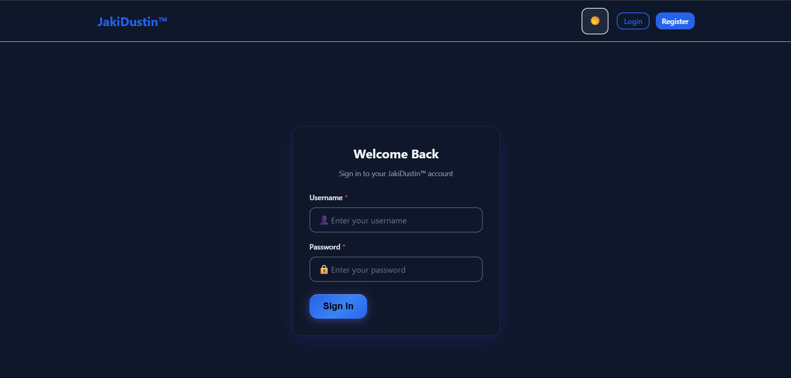

# JakiDustin™ - Full-Stack Inventory Management System

**A comprehensive, role-based inventory and asset management system built with Spring Boot and React.**

---

### **[Live Demo](https://inventory-system-portfolio.vercel.app/)**



*Note: The free-tier backend may take 30-60 seconds to "wake up" on the first visit.*

## 📖 About The Project

JakiDustin™ is a full-featured inventory management application designed to help organizations track, manage, and audit their physical assets. It provides a secure, multi-user environment with distinct roles and permissions, a complete borrowing and returning workflow, and detailed logging for all system activities. This project was developed by the **SaJakipir Boys**, a four-member team of developers from NU-MOA.

## ✨ Key Features

* **Role-Based Access Control:** Three distinct user roles (ADMIN, STAFF, VIEWER) with granular permissions.
* **Full CRUD Operations:** Complete Create, Read, Update, and Delete functionality for Assets and Categories.
* **JWT Authentication:** Secure login, registration, and session management using JSON Web Tokens.
* **Borrowing & Returning Workflow:** Users can request to borrow assets, which admins can approve or decline.
* **Advanced Search & Pagination:** Server-side filtering, sorting, and pagination for all major data tables.
* **Comprehensive Audit Trail:** Every action, from user login to asset modification, is logged for full traceability.
* **File Uploads:** Supports uploading and serving images for assets and category icons.
* **Dashboard & Reporting:** An admin dashboard provides an at-a-glance overview of key metrics and system activity.
* **Dark/Light Mode:** A sleek, modern UI with a theme toggle for user preference.

## 🛠️ Tech Stack

### Frontend
* **React.js**: A JavaScript library for building user interfaces.
* **React Router**: For client-side routing.
* **Axios**: For making HTTP requests to the backend API.
* **Framer Motion**: For smooth page transitions and animations.
* **CSS Modules**: For scoped and maintainable styling.

### Backend
* **Java & Spring Boot**: A robust framework for building enterprise-level applications.
* **Spring Security**: For handling authentication and authorization with JWT.
* **JPA & Hibernate**: For object-relational mapping and database interaction.
* **PostgreSQL**: A powerful, open-source relational database.
* **Maven**: For project build and dependency management.

### Deployment
* **Frontend:** Vercel
* **Backend:** Render
* **Database:** Neon (Serverless PostgreSQL)

## 🚀 Getting Started

To get a local copy up and running, follow these simple steps.

### Prerequisites

* Java 17+
* Node.js & npm
* Maven
* A local PostgreSQL database instance

### Backend Setup

1.  Navigate to the `backend` directory:
    ```sh
    cd backend
    ```
2.  Configure your local database in `src/main/resources/application.properties` by setting your `spring.datasource.url`, `username`, and `password`.
3.  Run the application:
    ```sh
    ./mvnw spring-boot:run
    ```
    The backend API will be available at `http://localhost:8080`.

### Frontend Setup

1.  Navigate to the `frontend` directory:
    ```sh
    cd frontend
    ```
2.  Install NPM packages:
    ```sh
    npm install
    ```
3.  Create a `.env.local` file in the `frontend` root directory and add the API URL:
    ```
    REACT_APP_API_URL=http://localhost:8080
    ```
4.  Run the application:
    ```sh
    npm start
    ```
    Open [http://localhost:3000](http://localhost:3000) to view it in the browser.

## 👥 About the Team

This project was brought to life by the **SaJakipir Boys**, a group of four friends and developers from NU-MOA:

* **Marc**: Frontend Developer
* **Rap**: Backend Developer
* **JJ**: Backend Developer
* **Gelo**: QA Specialist

## 📞 Contact

Jethro - [@Jethro663](https://github.com/Jethro663)

Project Link: [https://github.com/Jethro663/inventory-system-portfolio](https://github.com/Jethro663/inventory-system-portfolio)
